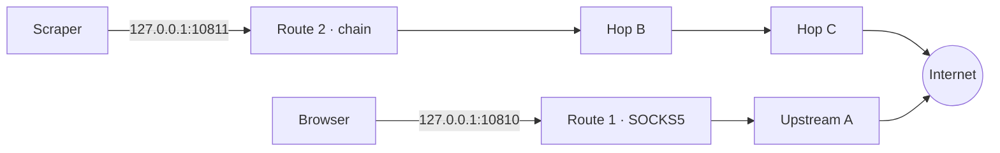
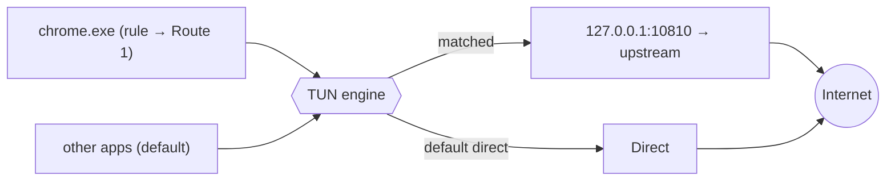
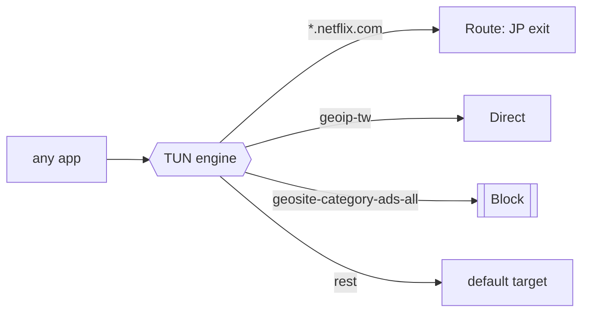

<div align="center">


[繁體中文](README.md) · **English**

Turn any SOCKS / HTTP upstream into **multiple local ports · multi-hop chains · per-app tunnels**, with a real fail-closed kill-switch.

[](https://github.com/guan4tou2/relay-client/actions/workflows/ci.yml)


[](https://github.com/guan4tou2/relay-client/releases)


</div>

---

## Why RelayClient?

If you've chained proxies with proxychains on Linux, think of RelayClient as its Windows GUI equivalent. The difference is that it does more than chaining: several local listener ports at once, each bound to its own proxy or full chain, plus sending a specific program down a specific path.

Most tools pick **one** model: either they **intercept per-app traffic** (Proxifier, ProxyCap, WideCap) or they run a **rule-based tunnel** (Clash / Mihomo — YAML-driven, for the Shadowsocks/VMess/Trojan ecosystem).

**RelayClient does both**, deliberately scoped to plain **SOCKS5 / SOCKS4 / HTTP / HTTPS** upstreams — no YAML, no exotic protocols, open-source and free. You get simultaneous local relay ports *and* per-app TUN interception in one small native app.

## Features

- **Multi-port routes**: every local port binds to its own upstream or chain, running independently and concurrently. Point Chrome at `:10810`, a scraper at `:10811`, each exiting through a different proxy.
- **Multi-hop chaining**: `your app → A → B → C → target`, proxychains-style, configured per route.
- **Per-app split routing (TUN)**: force programs by name or full path through a chosen route while everything else stays direct — like Proxifier, but on a modern TUN engine ([sing-box](https://github.com/SagerNet/sing-box), gVisor stack) rather than legacy LSP hooks. Works even for apps that have no proxy setting of their own.
- **Composable rules**: a single rule can match on **app × destination × port × protocol** at once (all conditions must hold), e.g. "`chrome.exe` reaching `*.netflix.com:443` goes through the JP node". Destinations can be a domain, suffix, keyword, regex, IP/CIDR, or a **region (GeoIP)** / **site category (GeoSite)** rule-set; each rule resolves to direct, a route, or **block**. Nothing is downloaded until you ask; you can also import your own `.srs` / `.json` offline.
  The rule engine and simulator are done; the GUI currently only edits the *app* condition — write the rest into `config.json` per **[RULES.md](RULES.md)** (the app preserves conditions it can't yet edit).
- **Kill-switch (fail-closed)**: if the split engine dies unexpectedly, protected apps are blocked rather than quietly falling back to your real IP. Domain and region rules are protected the same way.
- **Also included**: one-click system proxy, latency test, per-route traffic stats, live multi-hop view, dark / light / system theme, tray, boot auto-start, import/export, auto-update.
- **Hardened**: `contextIsolation` + `sandbox`, strict CSP, fully offline (no remote fonts/CDN), navigation locked to local pages.

## Overview


| Dashboard (multi-route) | Per-app split |
|---|---|
|  |  |
| **Servers (upstreams)** | **Settings** |
|  |  |

## How it works

RelayClient is built around **two independent routing planes** that can run at the same time — the second one matches either on *who is connecting* (Plane B) or *where the connection is going* (Plane C), on the same TUN adapter.

### Plane A — local relay ports

Each *route* opens a local listener (`127.0.0.1:<port>`) that speaks SOCKS5 or HTTP to your apps and forwards through the upstream (single hop or a chain). Routes are isolated — many run at once, each with its own exit.



### Plane B — per-app split via TUN

For apps that can't set a proxy, the engine raises a TUN adapter and routes by process. A rule sends `chrome.exe` into a route; unmatched traffic goes direct. The app and the engine always **bypass themselves** so the relay→upstream connection can't be re-captured (loop-safe by construction).



### Plane C — domain / region (GeoIP) routing, same TUN

On the same adapter, rules can also ask *where a connection is going*: domain, suffix, keyword, regex, IP/CIDR, or a **rule-set** match for region (GeoIP) and site category (GeoSite). Each rule resolves to direct, a route, or block.

Domain rules need the destination hostname, which under TUN only exists after sniffing TLS SNI / HTTP Host — so sniffing is enabled **only when a domain rule actually exists**; pure IP/region rules skip it. Whether process rules or domain rules are evaluated first is configurable (process rules first by default).



Rule-sets are sing-box `.srs` files. **Nothing is fetched until you press download** (sources are pinned to the official GitHub rule-set repos), and you can stay fully offline by importing your own `.srs` / `.json`. Format and manual setup: **[RULES.md](RULES.md)**.

### Kill-switch

If the engine crashes (vs. you stopping it), RelayClient immediately re-establishes the TUN in **block mode** — protected apps are dropped (`reject`), others keep working — and shows a red alert with **Reconnect / Disable**. It touches **no firewall rules**; it reuses the same TUN mechanism, so it adds no new footprint an endpoint monitor would flag.

## Compared to ProxyBridge · Proxifier · WideCap · Clash · ProxyCap

> ✅ yes · ➖ partial / limited · ❌ no. Written to be fair, not to win rows.

| | **RelayClient** | [ProxyBridge](https://github.com/InterceptSuite/ProxyBridge) | Proxifier | WideCap | Clash / Mihomo | ProxyCap |
|---|:---:|:---:|:---:|:---:|:---:|:---:|
| License / price | **MIT · free** | MIT · free | Commercial | Freeware, closed | Open-source | Commercial |
| Open source | ✅ | ✅ | ❌ | ❌ | ✅ | ❌ |
| Upstream types | SOCKS5/4 · HTTP(S) | SOCKS5 · HTTP | SOCKS4/5 · HTTP(S) | SOCKS · HTTP | SS · VMess · Trojan · SOCKS · HTTP … | SOCKS4/5 · HTTP(S) · SSH |
| Interception | TUN (sing-box) | WinDivert driver | LSP/kernel hooks | hooks | TUN | own driver |
| Per-app routing | ✅ | ✅ | ✅ | ✅ | ✅ | ✅ |
| **Many local ports, each → own upstream/chain** | ✅ **core** | ❌ | ➖ one active ruleset | ➖ | ➖ one mixed port | ➖ |
| Multi-hop chaining | ✅ per route | ❌ | ✅ | ➖ | ✅ relay groups | ✅ |
| Per-app **kill-switch** (fail-closed) | ✅ | ➖ block rules, not fail-closed | ➖ | ❌ | ➖ global TUN only | ➖ |
| Domain rules | ✅ | ✅ hostname + wildcards | ✅ | ❌ app only | ✅ **powerful** | ✅ |
| Region (GeoIP) rules | ✅ | ❌ | ✅ | ❌ | ✅ **powerful** | ✅ |
| One rule combining app × destination × port × protocol | ✅ | ✅ | ✅ | ❌ | ➖ via YAML | ✅ |
| UDP | ➖ depends on upstream | ✅ full | ✅ | ➖ | ✅ | ✅ |
| Config style | GUI | GUI + CLI | GUI | GUI | YAML (+ GUIs) | GUI |
| Platform | Windows 10/11 | Win · macOS · Linux | Win · macOS | Windows | cross-platform | Win · macOS |

- **vs [ProxyBridge](https://github.com/InterceptSuite/ProxyBridge)** — both MIT, both do per-app proxying, but by different means. ProxyBridge intercepts at packet level with the **WinDivert driver**, runs on Windows / macOS / Linux, has the **most complete UDP support**, ships a CLI for scripting, and matches on process, IP, port, protocol and hostname (with wildcards). RelayClient uses a **TUN adapter**, Windows only, and adds three things ProxyBridge doesn't have: **many local ports each bound to its own upstream or chain**, **multi-hop chaining**, and a genuinely **fail-closed kill-switch** — plus region (GeoIP) matching. If you need cross-platform, full UDP, or would rather not have a virtual adapter, ProxyBridge is the better fit.
- **vs Proxifier / ProxyCap** — mature *commercial* per-app proxifiers with rich, polished host/port/app rule engines. RelayClient is free & open and adds the multiple-local-ports-each-with-its-own-chain model plus a per-app kill-switch; its domain/region engine and GUI are both complete.
- **vs Clash / Mihomo** — a powerful rule-based tunnel for the SS/VMess/Trojan world with domain & GeoIP rules, configured in YAML. RelayClient stays simple: plain SOCKS/HTTP upstreams, routing by app or by port, zero YAML.
- **Which one should you pick?** Many ports + chaining + kill-switch on Windows → **RelayClient**. Cross-platform, full UDP or CLI automation → **ProxyBridge**. A mature domain/GeoIP GUI or SS/VMess/Trojan → **Clash / Mihomo**. Polished commercial host/port rules → **Proxifier / ProxyCap**.
- **vs WideCap** — an older, largely unmaintained Windows proxifier; RelayClient is a modern, open alternative with chaining and a kill-switch.
- **vs proxychains** — proxychains is a Linux CLI that uses `LD_PRELOAD` to hook the command you launch and push its connections through a proxy chain. RelayClient brings that chaining to a Windows GUI but intercepts at the network layer via a TUN adapter, so it also catches apps that ignore proxy settings, are statically linked, or use UDP, and it applies rules to already-running processes. proxychains, in turn, is lighter, scriptable, and needs no admin rights.

## Platform support

| | Plane A (local ports · chaining) | Plane B/C (per-app · domain/region) |
|---|:---:|:---:|
| **Windows 10/11** | ✅ shipping | ✅ shipping |
| macOS | ➖ code ready, no installer yet | ❌ TUN needs root plus a signed privileged helper — not implemented |
| Linux | ➖ code ready, no installer yet | ➖ code ready (one-time `setcap cap_net_admin`), not verified on hardware |

The core (local ports, chaining, rule generation, rule-sets) was never OS-specific; every platform
difference now lives in the three adapters under `src/platform/`, and CI runs the same suite on
Windows, macOS and Linux runners. **Only Windows installers are published today.**

## Install

Grab the latest from **[Releases](../../releases)**:

| File | Notes |
|---|---|
| `RelayClient-Setup-x.y.z.exe` | Installer — **auto-updates** itself |
| `RelayClient-Portable-x.y.z.exe` | Single portable exe — no self-update |

> Unsigned build → Windows SmartScreen may warn on first run: **More info → Run anyway**. The split engine asks for UAC once to create the TUN adapter; everything else runs unprivileged.

## Build from source

```bash
npm install
# Provide the TUN engine binary (compiled with the with_gvisor tag) at:
#   engine/sing-box.exe        ← not included in this repo
npm test          # 277 unit tests
npm run dist      # → dist/RelayClient-Setup-*.exe + Portable
```

The split engine uses [sing-box](https://github.com/SagerNet/sing-box); place a `sing-box.exe` built with the `with_gvisor` build tag at `engine/sing-box.exe` before packaging. See **[ROUTES.md](ROUTES.md)** for the route config schema and **[RULES.md](RULES.md)** for domain / region rules.

## Auto-update & releasing

The installer auto-updates via GitHub Releases (compares versions from `latest.yml`). To **cut a release**:

```bash
# 1) bump "version" in package.json (e.g. 1.1.1)
# 2) tag and push — GitHub Actions tests, fetches the engine, builds, and publishes the Release
git tag v1.1.1 && git push origin v1.1.1
```

`.github/workflows/release.yml` runs tests → downloads the sing-box engine → builds → publishes to Releases (with `latest.yml` for auto-update).

## Security

- `contextIsolation: true` · `nodeIntegration: false` · `sandbox: true`
- Strict **Content-Security-Policy** (`default-src 'self'`) — no remote resources; fully offline
- Navigation guards deny external window opens / navigation
- Loop-safe engine config: the app and `sing-box` always bypass themselves
- Server passwords and the credential vault are encrypted with the OS keystore (Electron `safeStorage`: DPAPI / Keychain / libsecret) before being written to disk; the log says so when encryption is unavailable
- HTTPS proxy certificates are verified by default; a per-server "skip certificate verification" switch exists for self-signed proxies (HTTPS servers created before this version keep the old unverified behaviour and are flagged in the list)
- Imported route ids/ports, the port written into the system proxy settings, and launched program paths are validated

## License

MIT © guantou
