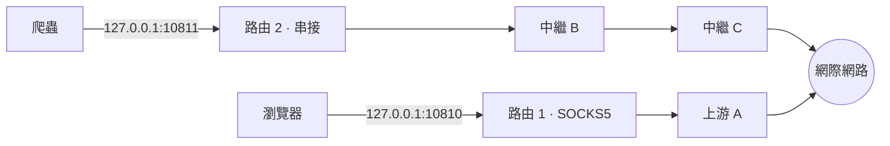
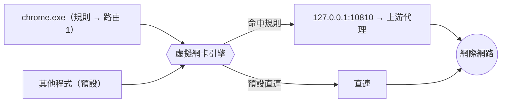
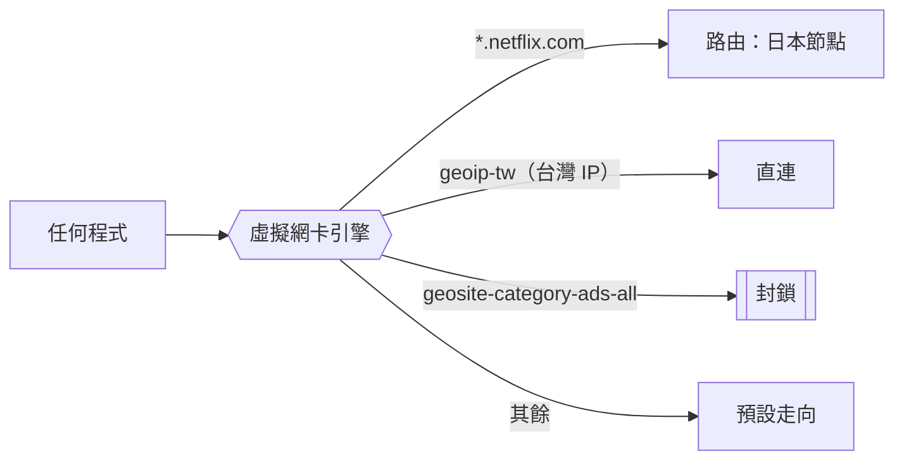

<div align="center">


**繁體中文** · [English](README.en.md)

把手上的 SOCKS / HTTP 代理，變成 **多個本地端口 · 多層串接 · 指定程式走代理**；斷線時受保護的程式一律封鎖，不會外洩真實 IP。

[](https://github.com/guan4tou2/relay-client/actions/workflows/ci.yml)


[](https://github.com/guan4tou2/relay-client/releases)


</div>

---

## 為什麼用 RelayClient？

如果你在 Linux 上用 proxychains 串過代理，RelayClient 可以想成它的 Windows 圖形版。差別是它不只做串鏈，還能同時開好幾個本地端口、各綁不同的代理或整條鏈，也能直接指定某支程式走哪一條路。

一般代理工具通常只做一件事：要嘛**攔截個別程式的連線**幫你轉走（Proxifier、ProxyCap、WideCap），要嘛做一個**靠規則自動分流的隧道**（Clash / Mihomo，要寫 YAML 設定，主打 Shadowsocks / VMess / Trojan 那類協定）。

**RelayClient 兩種都做**，但刻意只支援最單純的 **SOCKS5 / SOCKS4 / HTTP / HTTPS** 代理：不用寫 YAML，也不碰 Shadowsocks / VMess 那類協定。開源、免費。「多個本地端口」和「用虛擬網卡攔截指定程式」可以同時用，全在一支原生 app 裡。

## 功能

- **多端口路由**：每個本地端口綁定各自的代理（或一整串代理），彼此獨立、可同時開。例如 Chrome 指到 `127.0.0.1:10810`、爬蟲指到 `:10811`，各自從不同節點出網。
- **多層串接（串鏈）**：連線依序繞過好幾台代理再出網，`你的程式 → A → B → C → 目標`，等同 proxychains，每條路由分開設定。
- **指定程式走代理**：依程式名稱或完整路徑，把某些程式的連線導去代理、其餘直連，效果類似 Proxifier。底層是 [sing-box](https://github.com/SagerNet/sing-box) 的虛擬網卡（TUN）引擎，連本身沒有 proxy 設定的程式也管得到。
- **可組合的分流規則**：一條規則能同時吃 **程式 × 目的地 × 埠 × 協定**（全部條件都成立才命中），例如「`chrome.exe` 連 `*.netflix.com:443` 走日本節點」。目的地可以是網域、IP 網段、關鍵字，或用規則庫比對的**地區（GeoIP）與網站分類（GeoSite）**；走向可以是直連、某條路由，或直接**封鎖**。規則由上往下比對，第一條命中即生效，可拖曳排序。
- **三種模式**：`規則` 依規則表分流、`全域` 所有流量走同一條路由、`直連` 全部不經代理。切換不需重新提權，虛擬網卡與斷線保護維持運作。
- **內建「本機與內網 → 直連」**：釘在規則表最前面，可停用不可刪。避免印表機／NAS／路由器管理頁被送進代理（Proxifier 與 ProxyBridge 也都內建同樣的保護）。
- **規則模擬器**：輸入網域或 IP，直接看出會命中第幾條規則、走哪條路——用的是和引擎完全相同的比對順序。
- **斷線保護（Kill-switch）**：分流引擎萬一意外掛掉，受保護的程式會被直接封鎖，不會改走直連而露出真實 IP（也就是「失敗就斷」，fail-closed）。網域與地區規則同樣受保護。
- **其他日常功能**：一鍵開關系統代理、測連線延遲、每條路由的流量統計、串接路徑即時狀態、深色／淺色／跟隨系統主題、縮到系統匣、開機自動啟動、設定匯入匯出、自動更新。
- **安全設計**：畫面與系統權限隔離、內容安全政策（CSP）鎖死、完全離線，不連任何遠端字型或 CDN。

## 總覽


| 總覽（多條路由）| 指定程式走代理 |
|---|---|
|  |  |
| **伺服器（上游代理清單）** | **設定** |
|  |  |

## 運作原理

RelayClient 有**兩種可以同時使用的路由方式**：自建本地端口（方式 A），以及虛擬網卡分流（方式 B／C——同一張網卡，一個看「誰在連」、一個看「連去哪」）。

### 方式 A — 自建本地端口

每條*路由*會開一個本地端口（`127.0.0.1:<port>`），對你的程式提供 SOCKS5 或 HTTP，再把連線轉發到上游代理（單跳或多層串接）。各路由彼此獨立，可以多條同時開、各自從不同節點出網。支援 proxy 設定的程式（瀏覽器、curl、git）指過來就好，不用裝驅動、不攔截系統。



### 方式 B — 指定程式走代理（虛擬網卡 / TUN）

有些程式不能自己設定 proxy。這時引擎會建立一張**虛擬網卡（TUN）**，依「程式」來分流：一條規則把 `chrome.exe` 送進某條路由，沒被規則命中的就走直連。app 和引擎**永遠略過自己的流量**（不攔自己），這樣「本地中繼 → 上游代理」的連線才不會被虛擬網卡再抓回去繞圈，從設計上就避免了無限迴圈。



### 方式 C — 依網域 / 地區(GeoIP) 分流（同一張虛擬網卡）

同一張虛擬網卡上，除了「這支程式是誰」，也能問「這條連線要去哪」。**兩者可以寫在同一條規則裡**——條件全部成立才命中，例如「`chrome.exe` 連 `*.netflix.com` 的 443 埠」。目的地條件可以是網域（預設含子網域，加 `=` 表示完全相符）、IP 網段、關鍵字，或用**規則庫**比對的地區（GeoIP）與網站分類（GeoSite）；走向是直連、某條路由，或直接封鎖。

規則由上往下比對，第一條命中即生效，可拖曳調整優先序。最前面固定一條內建的「本機與內網 → 直連」（可停用不可刪），避免內網流量被送進代理。

網域條件需要嗅探（sniff）TLS 的 SNI 或 HTTP 的 Host 才拿得到網域——**只有真的存在網域條件時才會開啟嗅探**，純 IP／地區／埠／協定條件不需要，效能不受影響。



規則庫是 sing-box 的 `.srs` 檔，**預設不會下載任何東西**；使用者按下下載才連網（來源限定 GitHub 的官方 rule-set 倉庫），也可以完全離線匯入自己的 `.srs` / `.json`。格式與手動設定方式見 **[RULES.md](RULES.md)**。

### 斷線保護（Kill-switch）

引擎意外中止時（是它自己掛掉，不是你按停止），RelayClient 會立刻用封鎖模式重建虛擬網卡：受保護的程式流量直接丟棄，其他程式照常，同時跳出紅色提示讓你選「重新連線 / 停用」。整個過程完全不動 Windows 防火牆，用的是跟平常分流同一套機制，所以不會多出防毒或監控軟體會特別留意的新行為。

## 與 ProxyBridge · Proxifier · WideCap · Clash · ProxyCap 的差異

> ✅ 有 · ➖ 部分／受限 · ❌ 無。力求公允，不是為了贏。

| | **RelayClient** | [ProxyBridge](https://github.com/InterceptSuite/ProxyBridge) | Proxifier | WideCap | Clash / Mihomo | ProxyCap |
|---|:---:|:---:|:---:|:---:|:---:|:---:|
| 授權 / 價格 | **MIT · 免費** | MIT · 免費 | 商業付費 | 免費、閉源 | 開源 | 商業付費 |
| 開源 | ✅ | ✅ | ❌ | ❌ | ✅ | ❌ |
| 上游代理類型 | SOCKS5/4 · HTTP(S) | SOCKS5 · HTTP | SOCKS4/5 · HTTP(S) | SOCKS · HTTP | SS · VMess · Trojan · SOCKS · HTTP … | SOCKS4/5 · HTTP(S) · SSH |
| 攔截方式 | 虛擬網卡（TUN，sing-box） | WinDivert 驅動 | 系統掛鉤 | 系統掛鉤 | 虛擬網卡（TUN） | 自家驅動 |
| 指定程式走代理 | ✅ | ✅ | ✅ | ✅ | ✅ | ✅ |
| **多個本地端口、各綁不同代理／串接** | ✅ **核心特色** | ❌ | ➖ 只有單一規則集 | ➖ | ➖ 單一綜合端口 | ➖ |
| 多層串接 | ✅ 每條路由都能 | ❌ | ✅ | ➖ | ✅ 代理群組 | ✅ |
| 指定程式的**斷線保護** | ✅ | ➖ 有封鎖規則，非 fail-closed | ➖ | ❌ | ➖ 只有全域 | ➖ |
| 依網域自動分流 | ✅ | ✅ 主機名稱＋萬用字元 | ✅ | ❌ 只能依程式 | ✅ **強** | ✅ |
| 依地區(GeoIP) 自動分流 | ✅ | ❌ | ✅ | ❌ | ✅ **強** | ✅ |
| 同一條規則組合「程式 × 目的地 × 埠 × 協定」 | ✅ | ✅ | ✅ | ❌ | ➖ 要寫 YAML | ✅ |
| UDP | ➖ 看上游支不支援 | ✅ 完整 | ✅ | ➖ | ✅ | ✅ |
| 設定方式 | 圖形介面 | 圖形介面 ＋ 命令列 | 圖形介面 | 圖形介面 | YAML（另有圖形介面） | 圖形介面 |
| 平台 | Windows 10/11 | Win · macOS · Linux | Win · macOS | Windows | 跨平台 | Win · macOS |

**白話說**

- **對比 [ProxyBridge](https://github.com/InterceptSuite/ProxyBridge)**：兩邊都是 MIT、都做「指定程式走代理」，但走的路不一樣。ProxyBridge 用 **WinDivert 驅動**在封包層攔截，跨 Windows / macOS / Linux，**UDP 支援最完整**，還有命令列可以腳本化；規則能依程式、IP、端口、通訊協定與主機名稱（支援萬用字元）。RelayClient 用 **虛擬網卡（TUN）**，只做 Windows，但多了 ProxyBridge 沒有的三件事：**多個本地端口各綁不同代理／串接**、**多層串接（proxychains）**、以及**真正 fail-closed 的斷線保護**；地區(GeoIP) 分流也是 ProxyBridge 沒有的。規則模型（單一規則表、`程式 × 目的地 × 埠 × 協定` 可組合、動作分 直連/代理/封鎖）則是直接參考 ProxyBridge 的設計。反過來，如果你要的是跨平台、完整 UDP、或不想要虛擬網卡，ProxyBridge 更合適。
- **對比 Proxifier / ProxyCap**：它們是成熟的**商業**軟體，可以依「主機 / 端口 / 程式」設很細的規則，規則引擎與圖形介面都比較完整。RelayClient 免費開源，多了「多個本地端口各綁一串代理」和「指定程式的斷線保護」；網域／地區規則引擎與圖形介面都已完成。
- **對比 Clash / Mihomo**：Clash 支援 Shadowsocks/VMess/Trojan 一堆協定、能依網域和地區自動分流，但要寫 YAML。RelayClient 刻意簡單：只吃單純的 SOCKS/HTTP 代理、依「程式」或「端口」分流、完全不用寫設定檔。想要協定多樣＋規則引擎就用 Clash；只有幾台 SOCKS5 想要指定程式＋多端口＋串接的圖形介面就用 RelayClient。
- **對比 WideCap**：老牌 Windows 代理工具、幾乎停止維護；RelayClient 是現代、開源、還多了串接與斷線保護的替代品。
- **對比 proxychains**：proxychains 是 Linux 終端機工具，用 `LD_PRELOAD` 掛住你啟動的那支指令來串代理鏈；RelayClient 等於把它搬上 Windows GUI，改用虛擬網卡從網路層攔，因此連沒設 proxy、靜態編譯或走 UDP 的程式都管得到，也能對已經在跑的程式按名字套規則。反過來，proxychains 更輕、可腳本化、不用管理員權限。

### 什麼情況選誰

| 你的情況 | 最適合 |
|---|---|
| 「有幾台 SOCKS5/HTTP 代理，想要指定程式走代理＋多個本地端口＋串接，而且免費」 | **RelayClient** |
| 「要跨平台（Win/mac/Linux）、要完整 UDP、或想用命令列自動化，開源免費」 | ProxyBridge |
| 「需要依網域／地區自動分流的成熟圖形介面，或要用 Shadowsocks/VMess/Trojan」 | Clash / Mihomo |
| 「想要打磨成熟的商業軟體、依主機／端口設很細的規則」 | Proxifier / ProxyCap |

## 平台支援

| | 方式 A（本地端口 · 串接） | 方式 B/C（指定程式 · 網域/地區分流） |
|---|:---:|:---:|
| **Windows 10/11** | ✅ 已發行 | ✅ 已發行 |
| Linux | ➖ 已加打包（AppImage / deb），尚未實機驗證 | ➖ 程式碼已就緒（`setcap cap_net_admin` 一次授權即可），尚未實機驗證 |
| macOS | ➖ adapter 已寫、有測試 | ❌ 暫不開發（TUN 必須 root，且需要一支經簽章的特權助手） |

核心邏輯（本地端口、串接、規則生成、規則庫）本來就與 OS 無關；平台差異全部收斂在
`src/platform/` 的 adapter 裡，CI 在 Windows 與 Linux 兩個 runner 上跑同一套測試。
adapter 的邏輯刻意與執行主機無關（固定用 `path.win32` / `path.posix`），
所以 darwin adapter 即使沒有 macOS runner 也照樣被測到。

## 安裝

到 **[Releases](../../releases)** 下載最新版：

| 檔案 | 說明 |
|---|---|
| `RelayClient-Setup-x.y.z.exe` | 安裝版 —— 會**自動更新** |
| `RelayClient-Portable-x.y.z.exe` | 單一免安裝檔 —— 不會自動更新 |

> 目前未做程式碼簽章，首次執行時 Windows SmartScreen 可能跳警告：按**更多資訊 → 仍要執行**即可。指定程式走代理的功能需要一次 UAC（系統管理員授權）來建立虛擬網卡，其他功能都不需要特別權限。

## 從原始碼建置

```bash
npm install
# 放入虛擬網卡引擎執行檔（需以 with_gvisor tag 編譯，才有 TUN 功能）：
#   engine/sing-box.exe        ← 基於授權與檔案大小，本 repo 不含此檔
npm test          # 265 個單元測試
npm run dist      # → dist/RelayClient-Setup-*.exe 與免安裝版
```

引擎使用 [sing-box](https://github.com/SagerNet/sing-box)；打包前請把以 `with_gvisor` 標籤編譯的 `sing-box.exe` 放到 `engine/sing-box.exe`。路由設定檔格式見 **[ROUTES.md](ROUTES.md)**，網域／地區規則見 **[RULES.md](RULES.md)**。

## 自動更新與發佈新版

安裝版會自動向 GitHub Releases 檢查更新（比對版本號）。要**發佈新版**只要：

```bash
# 1) 改 package.json 的 version（例如 1.1.1）
# 2) 打一個版本 tag 推上去 —— GitHub Actions 會自動跑測試、抓引擎、打包、發佈 Release
git tag v1.1.1 && git push origin v1.1.1
```

`.github/workflows/release.yml` 會依序：跑測試 → 下載 sing-box 引擎 → 打包 → 發佈到 Releases（含自動更新所需的 `latest.yml`）。

## 安全性

（以下較技術，給想了解實作的人看）

- **畫面與系統隔離**：`contextIsolation: true`、`nodeIntegration: false`、`sandbox: true`——網頁畫面碰不到 Node/系統。
- **內容安全政策（CSP）**：`default-src 'self'`，禁止載入任何遠端資源，完全離線運作。
- **導覽防護**：禁止開啟外部視窗、禁止跳轉到外部網頁。
- **防迴圈**：app 與 `sing-box` 一律略過自己的流量。
- **密碼保護**：代理密碼透過 `electron-store` 存在 OS 使用者設定檔。

## 架構

```
main.js            Electron 主程式 — 視窗、系統匣、程序間通訊(IPC)、引擎與路由管理、自動更新
preload.js         安全橋接層（網頁端拿不到 Node）
renderer/          使用者介面（原生 JS、無障礙標籤）
src/proxy/         connect（串接）· socks-relay · http-bridge · route-manager（路由管理）── 與 OS 無關
src/engine/        singbox — 產生虛擬網卡設定 + 生命週期 + 斷線保護的封鎖模式 + 規則模擬器
                   ruleset — 依網域/地區分流的規則庫：內建目錄、下載/匯入/更新、交給引擎
src/platform/      平台適配層 — windows / darwin / linux 各一份，收斂所有 OS 差異
                   （引擎執行檔名、TUN 命名、提權方式、行程列舉、系統代理、開機自啟）
test/              265 個單元測試（jest）
```

## 授權

MIT © guantou
