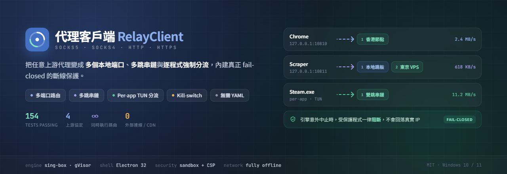
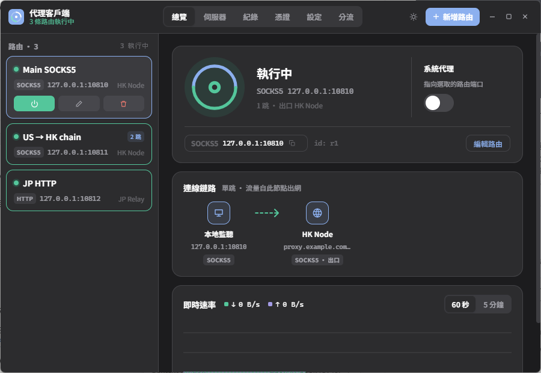
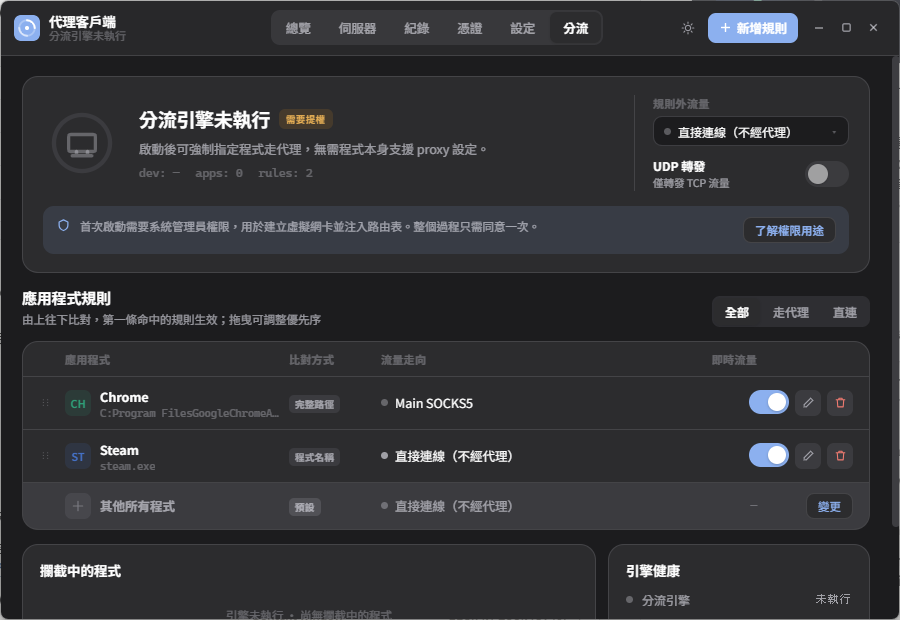
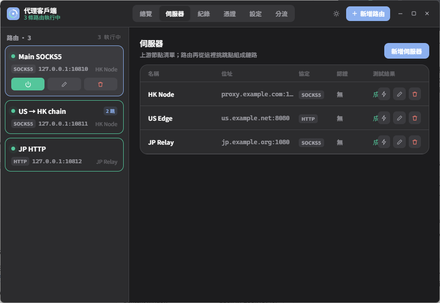
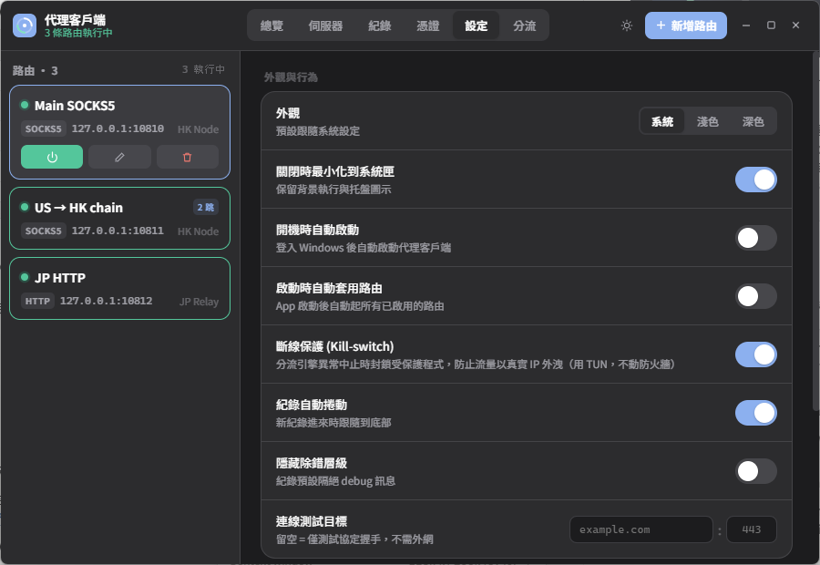
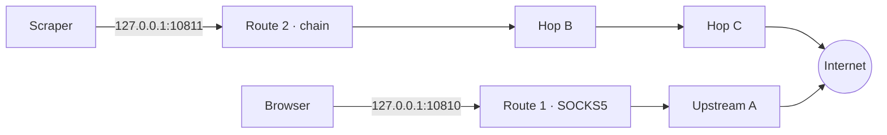
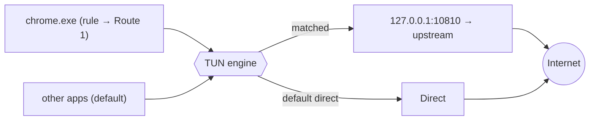

<div align="center">


**繁體中文** · [English](README.en.md)

把任意 SOCKS / HTTP 上游變成 **多個本地端口 · 多跳串鏈 · 逐程式強制分流**，內建真正 fail-closed 的斷線保護。

[](https://github.com/guan4tou2/relay-client/actions/workflows/ci.yml)


[](https://github.com/guan4tou2/relay-client/releases)


</div>

---

## 為什麼用 RelayClient？

多數工具只做一種模型：要嘛**逐程式攔截**（Proxifier、ProxyCap、WideCap），要嘛**規則式隧道**（Clash / Mihomo，YAML 驅動、主打 SS/VMess/Trojan 生態）。

**RelayClient 兩種都做**，且刻意聚焦在單純的 **SOCKS5 / SOCKS4 / HTTP / HTTPS** 上游——不寫 YAML、不碰花俏協定、開源免費。你同時擁有「多個本地中繼端口」與「逐程式 TUN 攔截」，全在一支小巧的原生 app 裡。

## 功能

- 🎛️ **多端口路由** — 每個本地端口綁定**各自**的上游或串鏈，彼此獨立、同時運作。Chrome 指到 `:10810`、爬蟲指到 `:10811`，各走不同出口。
- 🔗 **多跳串鏈** — `你 → A → B → C → 目標`，proxychains 那味，每條路由獨立設定。
- 🎯 **逐程式分流（TUN）** — 依**程式名或完整路徑**強制指定程式走代理，其餘直連 —— 像 Proxifier，但用現代 TUN 引擎（[sing-box](https://github.com/SagerNet/sing-box)，gVisor stack），不是老式 LSP hook。
- 🛡️ **斷線保護（fail-closed）** — 分流引擎意外中止時，受保護程式一律**阻斷**，不會回落用真實 IP 裸奔。
- 🔌 一鍵系統代理、延遲測試、每路由流量統計、多跳即時檢視。
- 🌗 深/淺/跟隨系統主題 · 系統匣 · 開機自啟 · 匯入匯出 · **自動更新**。
- 🔒 **強化**：`contextIsolation` + `sandbox`、嚴格 CSP、完全離線（無遠端字型/CDN）、導覽鎖在本地頁面。

## 總覽



| 總覽（多路由）| 逐程式分流 |
|---|---|
|  |  |
| **伺服器（上游節點）** | **設定** |
|  |  |

## 運作原理

RelayClient 圍繞**兩個可同時運作的獨立路由平面**設計。

### 平面 A — 自建本地端口

每條*路由*開一個本地監聽（`127.0.0.1:<port>`），對你的程式講 SOCKS5 或 HTTP，再轉發到上游（單跳或串鏈）。各路由彼此隔離，可多條同時跑、各有出口。



### 平面 B — 逐程式分流（TUN）

對於不能設定 proxy 的程式，引擎會建立 TUN 網卡並依程序路由。一條規則把 `chrome.exe` 送進某路由，未命中的走直連。app 與引擎**永遠 bypass 自己**，避免 relay→上游 的連線被再抓一次（結構上防迴圈）。



### 斷線保護（Kill-switch）

引擎異常中止（而非你主動停止）時，RelayClient 立即以 **block 模式**重建 TUN——受保護程式被丟棄（reject）、其餘照常——並跳出紅色告警與「重新連線 / 停用」。**不碰防火牆**，用的是同一套 TUN 機制，不會多出被端點監控盯上的新指紋。

## 與 Proxifier · WideCap · Clash · ProxyCap 的差異

> ✅ 有 · ➖ 部分/受限 · ❌ 無。力求公允，不是為了贏。

| | **RelayClient** | Proxifier | WideCap | Clash / Mihomo | ProxyCap |
|---|:---:|:---:|:---:|:---:|:---:|
| 授權 / 價格 | **MIT · 免費** | 商業 | 免費、閉源 | 開源 | 商業 |
| 開源 | ✅ | ❌ | ❌ | ✅ | ❌ |
| 上游類型 | SOCKS5/4 · HTTP(S) | SOCKS4/5 · HTTP(S) | SOCKS · HTTP | SS · VMess · Trojan · SOCKS · HTTP … | SOCKS4/5 · HTTP(S) · SSH |
| 逐程式路由 | ✅ TUN | ✅ LSP/核心 | ✅ | ✅ TUN + 程序規則 | ✅ 驅動 |
| **多本地端口，各綁不同上游/串鏈** | ✅ **核心** | ➖ 單一 ruleset | ➖ | ➖ 單一混合埠 | ➖ |
| 多跳串鏈 | ✅ 每路由 | ✅ | ➖ | ✅ relay group | ✅ |
| 逐程式 **kill-switch**（fail-closed） | ✅ | ➖ | ❌ | ➖ 僅全域 TUN | ➖ |
| 網域 / GeoIP 規則引擎 | ❌（依程式/依埠） | ✅ | 僅程式 | ✅ **強** | ✅ |
| 設定方式 | GUI | GUI | GUI | YAML (+GUI) | GUI |
| 平台 | Windows 10/11 | Win · macOS | Windows | 跨平台 | Win · macOS |

**白話**

- **vs Proxifier / ProxyCap**：那些是成熟的**商業**逐程式代理，規則引擎（host/port/app）很豐富。RelayClient 免費開源、多了「多個本地端口各綁串鏈」與逐程式 kill-switch，但**沒有**網域/host 規則引擎。
- **vs Clash / Mihomo**：Clash 是給 SS/VMess/Trojan 生態、有網域 & GeoIP 規則、YAML 設定的強大隧道。RelayClient 刻意簡單：純 SOCKS/HTTP 上游、依程式或依埠、零 YAML。要協定多樣 + 規則引擎選 Clash；只有幾台 SOCKS5 想要逐程式 + 多端口 + 串鏈的 GUI 就選 RelayClient。
- **vs WideCap**：老牌 Windows proxifier、幾乎停更；RelayClient 是現代、開源、有串鏈與 kill-switch 的替代。

### 什麼情況選誰

| 你的情況 | 最適合 |
|---|---|
| 「有幾台 SOCKS5/HTTP，想要逐程式 + 多本地端口 + 串鏈，免費」 | **RelayClient** |
| 「需要網域/GeoIP 規則、SS/VMess/Trojan」 | Clash / Mihomo |
| 「想要打磨過的商業逐程式代理、深度 host/port 規則」 | Proxifier / ProxyCap |

## 安裝

到 **[Releases](../../releases)** 下載最新版：

| 檔案 | 說明 |
|---|---|
| `RelayClient-Setup-x.y.z.exe` | 安裝版 —— 會**自動更新** |
| `RelayClient-Portable-x.y.z.exe` | 單一可攜檔 —— 不自更新 |

> 未簽章 → 首次執行 Windows SmartScreen 可能警告：**更多資訊 → 仍要執行**。分流引擎需要一次 UAC 提權來建立 TUN 網卡，其餘皆免權限。

## 從原始碼建置

```bash
npm install
# 放入 TUN 引擎執行檔（以 with_gvisor tag 編譯）：
#   engine/sing-box.exe        ← 不含在本 repo
npm test          # 154 個單元測試
npm run dist      # → dist/RelayClient-Setup-*.exe + Portable
```

分流引擎使用 [sing-box](https://github.com/SagerNet/sing-box)；打包前把以 `with_gvisor` build tag 編譯的 `sing-box.exe` 放到 `engine/sing-box.exe`。路由設定檔格式見 **[ROUTES.md](ROUTES.md)**。

## 自動更新與發版

安裝版透過 GitHub Releases 自動更新（讀 `latest.yml` 比對版本）。**發新版**只要：

```bash
# 1) 改 package.json 的 version（例如 1.1.1）
# 2) 打 tag 並推上去 —— GitHub Actions 會自動測試、抓引擎、打包、發佈 Release
git tag v1.1.1 && git push origin v1.1.1
```

`.github/workflows/release.yml` 會跑測試 → 下載 sing-box 引擎 → 打包 → 發佈到 Releases（含自動更新用的 `latest.yml`）。

## 安全性

- `contextIsolation: true` · `nodeIntegration: false` · `sandbox: true`
- 嚴格 **Content-Security-Policy**（`default-src 'self'`）—— 無遠端資源、完全離線運作
- 導覽防護：拒絕開啟外部視窗 / 離頁導覽
- 防迴圈設定：app 與 `sing-box` 永遠 bypass 自己
- 代理密碼以 `electron-store` 存於 OS 使用者設定檔

## 架構

```
main.js            Electron 主行程 — 視窗、系統匣、IPC、引擎與路由管理、自動更新
preload.js         contextBridge IPC 介面（renderer 無 Node）
renderer/          UI（原生 JS、inline 樣式、a11y roles）
src/proxy/         connect（串鏈）· socks-relay · http-bridge · route-manager
src/engine/        singbox — TUN 設定生成 + 生命週期 + kill-switch block 模式
src/system/        win-proxy（系統代理開關）
test/              154 個單元測試（jest）
```

## 授權

MIT © guantou
