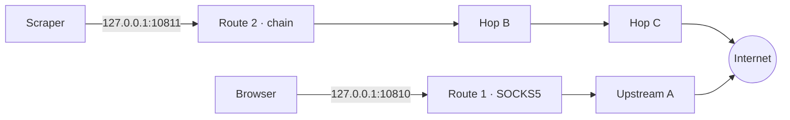
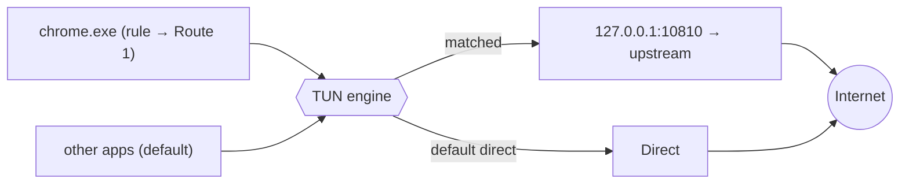

<div align="center">

# 代理客戶端 · RelayClient

**Turn any SOCKS/HTTP upstream into multiple local ports, multi-hop chains, and per-app tunnels — with a real fail-closed kill-switch.**

把任意 SOCKS/HTTP 上游變成 **多個本地端口 · 多跳串鏈 · 逐程式強制分流**，內建真正的斷線保護。


</div>

---

## Why another proxy client?

Most tools pick **one** model:

- **Per-app interceptors** (Proxifier, ProxyCap, WideCap) force specific programs through a proxy, but expose no local endpoints and run a single active ruleset.
- **Rule-based tunnels** (Clash / Mihomo) route by domain/GeoIP for the Shadowsocks/VMess/Trojan ecosystem, driven by YAML.

**RelayClient does both**, deliberately scoped to plain **SOCKS5 / SOCKS4 / HTTP / HTTPS** upstreams — no YAML, no exotic protocols, open-source and free. You get simultaneous local relay ports *and* per-app TUN interception in one small native app.

---

## Features · 功能

- 🎛️ **Multi-port routes** — every local port binds to its **own** upstream or chain and runs **independently and concurrently**. Point Chrome at `:10810`, a scraper at `:10811`, each exiting through a different proxy.
- 🔗 **Multi-hop chaining** — `you → A → B → C → target`, proxychains-style, per route.
- 🎯 **Per-app split routing (TUN)** — force programs by **name or full path** through a chosen route while everything else stays direct — like Proxifier, using a modern TUN engine ([sing-box](https://github.com/SagerNet/sing-box), gVisor stack) instead of legacy LSP hooks.
- 🛡️ **Kill-switch (fail-closed)** — if the split engine dies unexpectedly, protected apps are **blocked**, not silently leaked through your real IP.
- 🔌 **One-click system proxy**, latency test, per-route traffic stats, multi-hop live view.
- 🌗 Dark / light / system theme · tray · boot auto-start · import/export · auto-update.
- 🔒 **Hardened**: `contextIsolation` + `sandbox`, strict CSP, fully offline (no remote fonts/CDN), navigation locked to local pages.

---

## How it works · 設計介紹

RelayClient is built around **two independent routing planes** that can run at the same time.

### Plane A — local relay ports (自建本地端口)

Each *route* opens a local listener (`127.0.0.1:<port>`) that speaks SOCKS5 or HTTP to your apps and forwards through the upstream (single hop or a chain). Routes are isolated — many run at once, each with its own exit.



An app that natively supports a proxy (browser, curl, git) just points at the port. No drivers, no interception.

### Plane B — per-app split via TUN (逐程式分流)

For apps that *don't* let you set a proxy, the engine raises a TUN adapter and routes by process. A rule sends `chrome.exe` into a route; unmatched traffic goes direct. The app and the engine always **bypass themselves** so the relay→upstream connection can't be re-captured (loop-safe by construction).



### Kill-switch (斷線保護)

If the engine crashes (vs. you stopping it), RelayClient immediately re-establishes the TUN in **block mode** — protected apps are dropped (`reject`), others keep working — and shows a red alert with **Reconnect / Disable**. No firewall rules are touched; it reuses the same TUN mechanism, so it adds no new footprint an endpoint monitor would flag.

---

## Compared to Proxifier · WideCap · Clash · ProxyCap

> ✅ yes · ➖ partial / limited · ❌ no. Written to be fair, not to win rows.

| | **RelayClient** | Proxifier | WideCap | Clash / Mihomo | ProxyCap |
|---|:---:|:---:|:---:|:---:|:---:|
| License / price | **MIT · free** | Commercial | Freeware, closed | Open-source | Commercial |
| Open source | ✅ | ❌ | ❌ | ✅ | ❌ |
| Upstream types | SOCKS5/4 · HTTP(S) | SOCKS4/5 · HTTP(S) | SOCKS · HTTP | SS · VMess · Trojan · VLESS · SOCKS · HTTP … | SOCKS4/5 · HTTP(S) · SSH |
| Per-app routing | ✅ TUN | ✅ LSP/kernel | ✅ | ✅ TUN + process rule | ✅ driver |
| **Many local ports, each → own upstream/chain** | ✅ **core** | ➖ one active ruleset | ➖ | ➖ one mixed port | ➖ |
| Multi-hop chaining | ✅ per route | ✅ | ➖ | ✅ relay groups | ✅ |
| Per-app **kill-switch** (fail-closed) | ✅ | ➖ | ❌ | ➖ global TUN only | ➖ |
| Domain / GeoIP rule engine | ❌ (by app / by port) | ✅ host/port/app | app only | ✅ **powerful** | ✅ host/port/app |
| Config style | GUI | GUI | GUI | YAML (+ GUIs) | GUI |
| Platform | Windows 10/11 | Win · macOS | Windows | cross-platform | Win · macOS |

**In prose:**

- **vs Proxifier / ProxyCap** — those are mature *commercial* per-app proxifiers with rich host/port/app rule engines. RelayClient is free & open, adds the *multiple-simultaneous-local-ports-each-with-its-own-chain* model and a per-app kill-switch, but intentionally has **no** domain/host rule engine.
- **vs Clash / Mihomo** — Clash is a powerful rule-based tunnel for the SS/VMess/Trojan world with domain & GeoIP rules, configured in YAML. RelayClient stays simple: plain SOCKS/HTTP upstreams, routing by app or by port, zero YAML. Pick Clash for protocol variety + a rule engine; pick RelayClient when you just have some SOCKS5 proxies and want per-app + multi-port + chaining in a GUI.
- **vs WideCap** — WideCap is an older Windows proxifier that's largely unmaintained. RelayClient is a modern, open alternative with chaining and a kill-switch.

### When to use which

| Your situation | Best fit |
|---|---|
| "I have a few SOCKS5/HTTP proxies and want per-app + multiple local ports + chaining, free" | **RelayClient** |
| "I need domain/GeoIP rules and Shadowsocks/VMess/Trojan" | Clash / Mihomo |
| "I want a polished commercial per-app proxifier with deep host/port rules" | Proxifier / ProxyCap |

---

## Install · 安裝

Grab the latest from **[Releases](../../releases)**:

| File | Notes |
|---|---|
| `RelayClient-Setup-x.y.z.exe` | Installer — **auto-updates** itself via GitHub Releases |
| `RelayClient-Portable-x.y.z.exe` | Single portable exe — does **not** self-update |

> Unsigned build → Windows SmartScreen may warn on first run: **More info → Run anyway**. The split-routing engine needs a one-time UAC prompt to create the TUN adapter; everything else runs unprivileged.

---

## Build from source · 從原始碼建置

```bash
npm install
# Provide the TUN engine binary (compiled with the `with_gvisor` tag) at:
#   engine/sing-box.exe        ← not included in this repo
npm test          # 154 unit tests
npm run dist      # → dist/RelayClient-Setup-*.exe + Portable
```

The split engine uses [sing-box](https://github.com/SagerNet/sing-box); place a `sing-box.exe` built with the `with_gvisor` build tag (for TUN) at `engine/sing-box.exe` before packaging.

See **[ROUTES.md](ROUTES.md)** for the config-file schema (routes, chains).

---

## Security · 安全性

- `contextIsolation: true` · `nodeIntegration: false` · `sandbox: true`
- Strict **Content-Security-Policy** (`default-src 'self'`) — no remote resources; the app runs fully offline
- Navigation guards deny external window opens / navigation
- Loop-safe engine config: the app and `sing-box` always bypass themselves
- Proxy passwords stored via `electron-store` (OS user profile)

## Architecture · 架構

```
main.js            Electron main — window, tray, IPC, engine + route managers, auto-update
preload.js         contextBridge IPC surface (no Node in renderer)
renderer/          UI (vanilla JS, inline styles, a11y roles)
src/proxy/         connect (chain hops) · socks-relay · http-bridge · route-manager
src/engine/        singbox — TUN config generator + lifecycle + kill-switch block mode
src/system/        win-proxy (system proxy toggle)
test/              154 unit tests (jest)
```

## License

MIT © guantou
